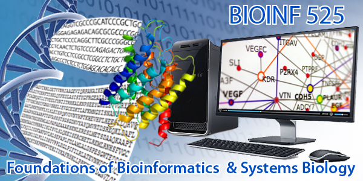

# Foundations of Bioinformatics and Systems Biology

**Overview:** BIOINF 525 introduces students to the fundamental principles and practices of bioinformatics and systems biology.  

**Description:** This course consists of three modules: (1) [Foundations of Bioinformatics]({{ site.baseurl }}/module1/); (2) [Introduction to Statistics in Bioinformatics]({{ site.baseurl }}/module2/); (3) [Bioinformatics and Systems Biology]({{ site.baseurl }}/module3/).

Concepts covered include integrating and accessing major online molecular bioinformatics resources, analysis of genomic data, protein structures, gene expression data, protein-protein interactions, pathways and networks. as well as basic statistics as used in bioinformatics.  

The broader goal is to point towards perspectives that bioinformatics can expose for the integration and analysis of complex biological information.  

**Audience:** Students already familiar with basic biomedical concepts that wish to learn the computational tools, techniques and best practices of bioinformatics, biostatistics and systems biology. 

**Requirements:** Participants must bring a laptop to lectures with [specific software packages installed]({{ site.baseurl }}/setup/). Note that no formal programming or UNIX skills are needed. 

**When:** January 12 to April 15, 2016 

**Where:** Palmer Commons Rms. 2062 (lectures) and 2036 (labs) [Map](https://www.google.com/maps/dir///@42.2807432,-83.7302821,19z)

**Class Questionnaire** Please help us improve this course by completing this [questionnaire](http://tinyurl.com/bioboot-questions). 

 

#### [Module 1. Foundations of Bioinformatics]({{ site.baseurl }}/module1/) 

| Session | Date      | Topics                   | 
| :-----: |:---------:| :----------------------- | 
| 1.1     | 1/12/2016  | **Introduction to bioinformatics** | 
|      |  | Bioinformatics databases and major online resources | 
| 1.2     | 1/19/2016 | **Sequence alignment and database searching**  | 
|      |  | Sequence alignment algorithms and applications  | 
| 1.3     | 1/26/2016 | **Structural bioinformatics**       | 
|      |  | Structure visualization, analysis and small molecule docking       | 
| 1.4     | 2/2/2016 | **Genome informatics**                    | 
|      |  | Web resources for analyzing genomic data  | 

 

#### [Module 2. Introduction to Statistics in Bioinformatics]({{ site.baseurl }}/module2/)

| Session | Date      | Topics                   | 
| :-----: |:---------:| :----------------------- | 
| 2.1     | 2/9/2016  | **Framework for statistical analysis of biomedical data** | 
|      |  | Bioinformatics databases and major online resources | 
| 2.2     | 2/16/2016 | **Approaches to statistical estimation and testing**  | 
|      |  | Sequence alignment algorithms and applications  | 
| 2.3     | 2/23/2016 | **Analyses involving associations**       | 
|      |  | Structure visualization, analysis and small molecule docking       | 
| 2.4     | 3/8/2016 | **Linear regression**                    | 
|      |  | Web resources for analyzing genomic data  | 
| 2.5     | 3/15/2016 | **Graphical methods for multivariate data analysis**                    | 
|      |  | Web resources for analyzing genomic data  | 

 

#### [Module 3. Bioinformatics and Systems Biology]({{ site.baseurl }}/module3/) 

| Session | Date      | Topics                   | 
| :-----: |:---------:| :----------------------- | 
| 3.1     | 1/12/2016  | **Introduction to systems biology** | 
|      |  | Network analysis for systems biology | 
| 3.2     | 1/19/2016 | **Computational clinical decision support systems**  | 
|      |  | WEKA for machine learning and feature analysis  | 
| 3.3     | 1/26/2016 | **Systems biology approaches in pharmacogenomics**       | 
|      |  | Introduction to pharmacogenomics       | 
| 3.4     | 2/2/2016 | **Application of systems biology to translational medicine**                    | 
|      |  | Systems biology resources for translational medicine  | 

 
 

